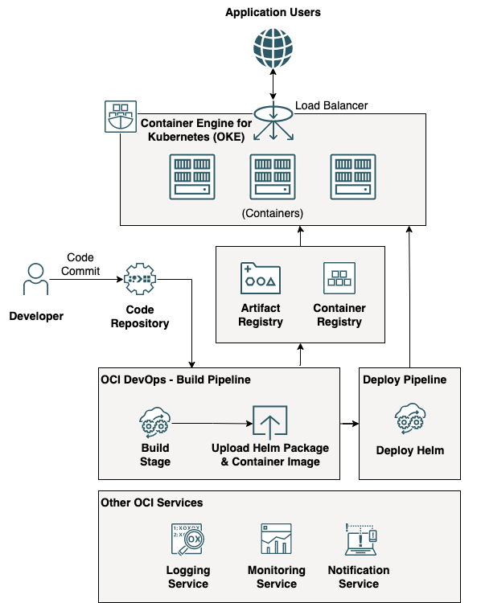

# terraform-oci-arch-devops-cicd-oke-helm

Rapid delivery of software is essential for efficiently running your applications in the cloud. Oracle DevOps service provides an end-to-end continuous deployment experience to developers. Oracle DevOps service includes deployment pipelines to automate your continuous software delivery and deployment process (CD) to Oracle Cloud Infrastructure (OCI) platforms: Container Engine for Kubernetes (OKE), Functions, and Compute instances. Automating software releases with pipeline deployment increases developer productivity and allows you to release features more frequently and with fewer errors. It helps avoid downtime during deployments and automates the complexity of updating applications. Oracle DevOps can be used by both customers migrating workloads from on-premises or other clouds to OCI and customers developing new applications on OCI.

This architecture shows a sample NodeJS application deployed with Helm Chart from the Code Repository using the Oracle Cloud Infrastructure (OCI) DevOps service. The application is deployed to Oracle Cloud Infrastructure Container Engine for Kubernetes (OKE) cluster. To simplify the process, we use Terraform for infrastructure automation.

For details of the architecture, see [Deploy a Helm-based application with OCI DevOps](https://docs.oracle.com/en/solutions/deploy-helm-based-app-oci-devops/)

## Architecture Diagram



## Prerequisites

- Permission to `manage` the following types of resources in your Oracle Cloud Infrastructure tenancy: `vcns`, `internet-gateways`, `load-balancers`, `route-tables`, `security-lists`, `subnets`, and `instances`.

- Quota to create the following resources: 1 VCN, 3 subnets, 1 Internet Gateway, 1 NAT Gateway, 2 route rules, ...

If you don't have the required permissions and quota, contact your tenancy administrator. See [Policy Reference](https://docs.cloud.oracle.com/en-us/iaas/Content/Identity/Reference/policyreference.htm), [Service Limits](https://docs.cloud.oracle.com/en-us/iaas/Content/General/Concepts/servicelimits.htm), [Compartment Quotas](https://docs.cloud.oracle.com/iaas/Content/General/Concepts/resourcequotas.htm).

## Deploy Using Oracle Resource Manager

1. Click [](https://cloud.oracle.com/resourcemanager/stacks/create?region=home&zipUrl=https://github.com/oracle-devrel/terraform-oci-arch-devops-cicd-oke-helm/releases/latest/download/terraform-oci-arch-devops-cicd-oke-helm-stack-latest.zip)

    If you aren't already signed in, when prompted, enter the tenancy and user credentials.

2. Review and accept the terms and conditions.

3. Select the region where you want to deploy the stack.

4. Follow the on-screen prompts and instructions to create the stack.

5. After creating the stack, click **Terraform Actions**, and select **Plan**.

6. Wait for the job to be completed, and review the plan.

    To make any changes, return to the Stack Details page, click **Edit Stack**, and make the required changes. Then, run the **Plan** action again.

7. If no further changes are necessary, return to the Stack Details page, click **Terraform Actions**, and select **Apply**. 

## Deploy Using the Terraform CLI

### Clone the Repo

Now, you'll want a local copy of this repo. You can make that with the commands:

```
    git clone https://github.com/oracle-devrel/terraform-oci-arch-devops-cicd-oke-helm.git
    cd terraform-oci-arch-devops-cicd-oke-helm
    ls
```

### Prerequisites
First off, you'll need to do some pre-deploy setup.  That's all detailed [here](https://github.com/cloud-partners/oci-prerequisites).

Secondly, a sample `terraform.tfvars` file is provided in the repo. Please update the file with your tenancy details.

Alternatively, you can create a `terraform.tfvars` file and populate with the following information as well as any additional information for your deployment:

```
# Authentication
tenancy_ocid         = "<tenancy_ocid>"
user_ocid            = "<user_ocid>"
fingerprint          = "<finger_print>"
private_key_path     = "<pem_private_key_path>"
compartment_ocid     = "<compartment_ocid>"

# Region
region = "<oci_region>"

# OCI User and Authtoken
oci_username       = "<oci_username> 
# For a federated user (single sign-on with an identity provider), enter the username in the following format: TenancyName/Federation/UserName. 
# For example, if you use OCI's identity provider, your login would be, Acme/oracleidentitycloudservice/alice.jones@acme.com. 
#If you are using OCI's direct sign-in, enter the username in the following format: TenancyName/YourUserName. For example, Acme/alice_jones. Your password is the auth token you created previously.
oci_user_authtoken = "<oci_user_authtoken>" 
# You can get the auth token from your Profile menu -> click User Settings -> On left side  click *Auth Tokens -> Generate Token


````

### Create the Resources
Run the following commands:

    terraform init
    terraform plan
    terraform apply


### Destroy the Deployment
When you no longer need the deployment, you can run this command to destroy the resources:

    terraform destroy

## License
Copyright (c) 2022 Oracle and/or its affiliates.

Licensed under the Universal Permissive License (UPL), Version 1.0.

See [LICENSE](LICENSE) for more details.
